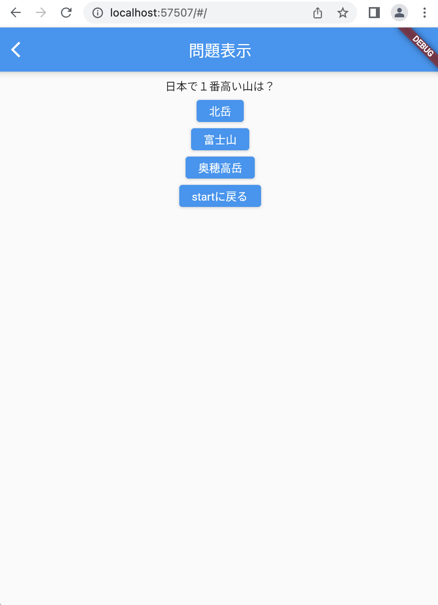

# クイズアプリを作ろう 03

## 03_quizdisplay

### 出題画面にクイズを表示

#### **【課題】**

- [ ] クイズの内容を配列のデータとして作成
- [ ] 配列のデータを画面に表示
- [ ] //★の部分を追加する

#### **【ポイント】**

- ①クイズ一覧をmapに格納しよう
- ②1問目のクイズを表示させよう

#### **【ソースコード】**

```Dart
// class QuizListPageまで省略

class _QuizListPageState extends State<QuizListPage> {

  // ★①クイズ一覧をmapに格納しよう
  List<Map<String, dynamic>> quizlist = [
    {
      "question": "日本で一番高い山は？",
      "answer1": "北岳",
      "answer2": "富士山",
      "answer3": "奥穂高岳",
      "correct": 2
    },
    {
      "question": "日本で１番長い川は？",
      "answer1": "信濃川",
      "answer2": "利根川",
      "answer3": "石狩川",
      "correct": 1
    },
    {
      "question": "日本で一番広い湖は？",
      "answer1": "霞ヶ浦",
      "answer2": "サロマ湖",
      "answer3": "琵琶湖",
      "correct": 3
    },
    {
      "question": "日本で一番広い県は？",
      "answer1": "北海道",
      "answer2": "広島県",
      "answer3": "東京都",
      "correct": 1
    },
    {
      "question": "日本で一番小さい県は？",
      "answer1": "沖縄県",
      "answer2": "香川県",
      "answer3": "東京都",
      "correct": 2
    },
  ];
  // ここまで

  @override
  Widget build(BuildContext context) {
    return Scaffold(
      appBar: AppBar(
        centerTitle: true,
        title: Text('問題'),
      ),
      body: Center(

        // ★②1問目のクイズを表示させよう
        child: Column(
          children: [
            Container(
              padding: const EdgeInsets.all(30.0),
              child: Text(quizlist[0]["question"]),
            ),
            Row(
              mainAxisAlignment: MainAxisAlignment.spaceEvenly,
              children: [
                ElevatedButton(
                    onPressed: () {}, child: Text(quizlist[0]["answer1"])),
                ElevatedButton(
                    onPressed: () {}, child: Text(quizlist[0]["answer2"])),
                ElevatedButton(
                    onPressed: () {}, child: Text(quizlist[0]["answer3"])),
              ],
            ),
            Container(
              padding: EdgeInsets.only(top: 50),
              child: TextButton(
                  onPressed: Navigator.of(context).pop,
                  child: Text('STARTに戻る')),
            )
          ],
        ),
        // ここまで

      ),
    );
  }
}

```

#### **【結果】**  

- [ ] １問目の情報が表示されること  


